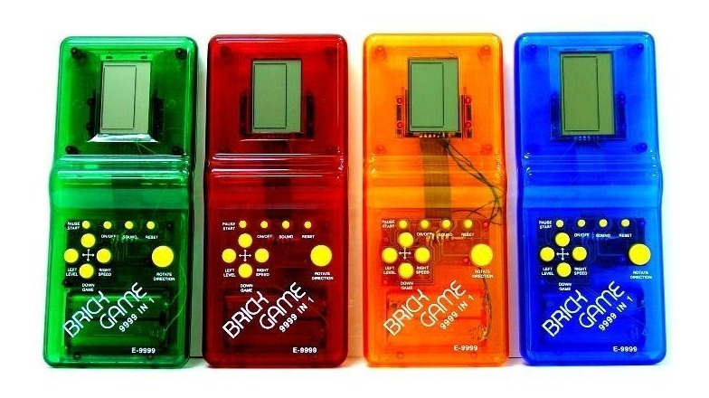
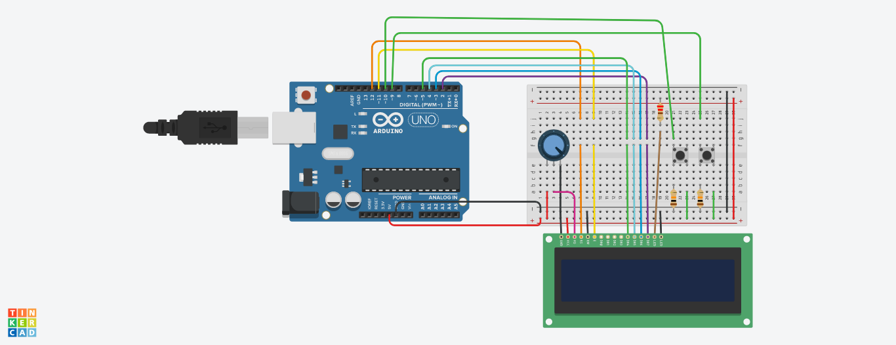

# carRacing
Projeto da cadeira de Introducao a computacao do Centro de Informatica- UFPE

## Descrição

Fazer um minigame de corrida de carrinho semelhantes aos videogames antigos que vinha 9999 games em 1.

O programa deve rodar em um Arduino usando como interface uma tela LCD e 2 botões como pode ser visto na imagem abaixo.

A lista de materiais pode ser encontrada [aqui](./bom.csv).

## Step up

Como evolução do projeto deve ser implementado uma leitura de comandos pela porta serial, permitindo que o jogo seja controlado pelo teclado.
